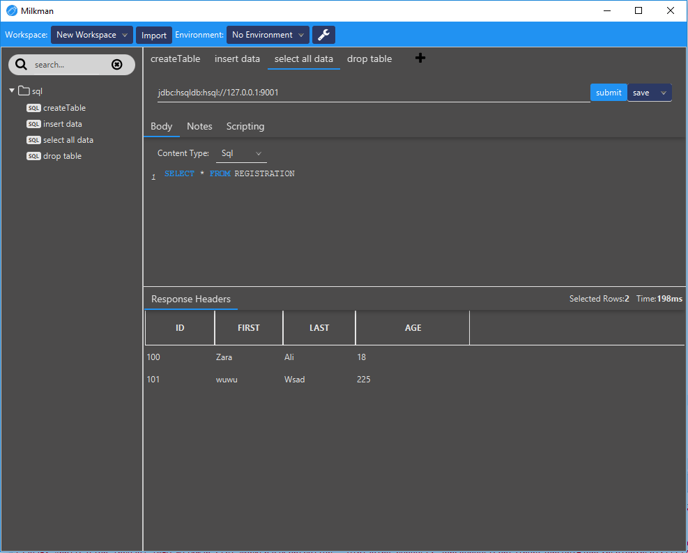

#  Milkman - An Extensible Request/Response Workbench

Milkman is heavily inspired by Postman. But I got sick of all those electron-based applications that need ages and loads of memory to start up.
Therefore i created a JavaFx-based workbench for crafting requests / responses. It is not limited to e.g. http (or more specifically rest) requests. Due to nearly
everything being a plugin, other things are possible, like database-requests or GRPC, GraphQl, etc...

# Download

 * Download latest version in [Release Section](https://github.com/warmuuh/milkman/releases). 
 * **Download plugin archive as well**, if you want to use any of those plugins.

For downloading the nightly build:

 * Login to circleci.com (e.g. via github-authentication)
 * Go to [Milkman Builds](https://circleci.com/gh/warmuuh/milkman/tree/master)
 * Choose latest build and Download the build from the artifacts tab
 
# Install via Chocolatey
 * To install just Milkman run `Choco install milkman`
 * To install a plugin run `Choco install milkman-<plugin name>` ex. `Choco install milkman-explore`
 * Install Milkman and all plugins available run `Choco install milkman-plugins` 

# Changes

latest changes can be seen in the [Changelog](changelog.md)

# Features

 * **Everything is a plugin:** Request-types (e.g. Http Request), request-aspects (e.g. Headers, Body, etc), editors for request aspects (e.g. table-based editors for headers), importers, whatever it is, you can extend it. The core application only handles Workspaces with Environments, Collections, Requests and their aspects.
 * **Http Request Plugin:** Several plugins are provided already that extend the core application to be a replacement for postman. Crafting and Executing Http/Rest requests with json highlighting. Support Proxy-server configuration and SSE.
 * **Grpc Plugin:** support of Grpc Services, Server Reflection and Streaming
 * **JavaFX Application:** as in: *fast* (compared to electron at least :D) and skinn-able (you can extend milkman with your own themes using simple CSS).
 * **Commandline Interface:** there is a [command line interface](/milkman-cli) for Milkman which allows to edit/execute requests on your command line.
 * [Some more details](docs/features.md) of the core application features, such as hotkeys etc.
 
# Existing Plugins:

*Note: see respective plugin folder for more details*

### [Http Request Plugin](/milkman-rest): (included in main distribution)
The Http request plugin packaged with the release contains all means to do http request as well as import collections, environments or dumps from postman.
To migrate from postman, just [export a dump-file from postman](https://learning.getpostman.com/docs/postman/collections/data_formats/#data-dumps) and import it by pasting its content into the `Postman (v2.1) Dump`-Importer.
The Http Request Plugin also comes with Proxy-support. Some proxies require credentials and support for supplying `BASIC` proxy credentials is built into the plugin. See Options-page to activate that as it is off by default.
Additionally, the plugin supports chunked responses, enabling testing of Server-sent events ([SSE](https://en.wikipedia.org/wiki/Server-sent_events)).

### [Graphql Plugin](/milkman-graphql)
Simple Graphql Plugin to craft  [GraphQL](https://graphql.org/) requests. No Auto-complete or schema valiadtion included.

### [Grpc Plugin](/milkman-grpc)
Grpc plugin with [server-reflection](https://github.com/grpc/grpc/blob/master/doc/server-reflection.md) support and streaming-support. Can also query via proto-defintion.

### [JDBC Plugin](/milkman-jdbc)
This plugin introduces SQL capability to milkman. You can query SQL databases via milkman as well, using JDBC drivers.

### [Git Team Synchronization Plugin](/milkman-sync-git)
This plugin allows to synchronize workspaces via Git (using Differential Synchronization). Teams can use this plugin to have a shared workspace that synchronizes between members.

### [Explore Plugin](/milkman-explore):
This plugin extends Rest-responses by adding an `Explore`-Tab where you can use [JMesPath](http://jmespath.org/) queries against a JSON response.

### [Scripting Plugin](/milkman-scripting):
Extends requests by executing a script after request execution. This allows to e.g. set environment variables based on results of json.

### [PrivateBin Sharing Plugin](/milkman-privatebin)
Adds capability to share requests via [PrivateBin](http://PrivateBin.net), including `Burn After Reading` feature

### [Note Plugin](/milkman-note):
This is a sample plugin that allows to add arbitrary description to every request. Serves as a starting point for learning to extend milkman.

# Showcase

# Plugins

No client fits all, so you are **encouraged** to write your own plugins to e.g. add headers that are necessary for your internal service structures or add importers for internal service registries.

A [sample plugin](https://github.com/warmuuh/milkman/tree/master/milkman-note) was provided that extends all requests with a `Note` tab so you can add some description to any kind of requests.

More details about developing plugins can be found in the [plugin development guide](/docs/plugin-development.md).

*Installation:* all plugins are to be copied to the `/plugins` folder

# Roadmap
This is only the beginning. Following features are already planned:

 * javascript runner for pre request actions / testing of responses
 * more exports
 * different request types (e.g. GraphQl Client, Grpc, protobuf etc)

latest changes can be seen in the (Changelog)[changelog.md]
