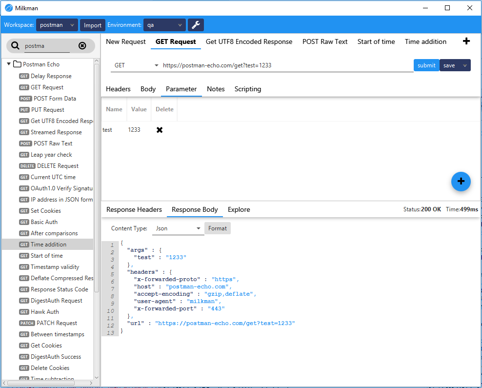
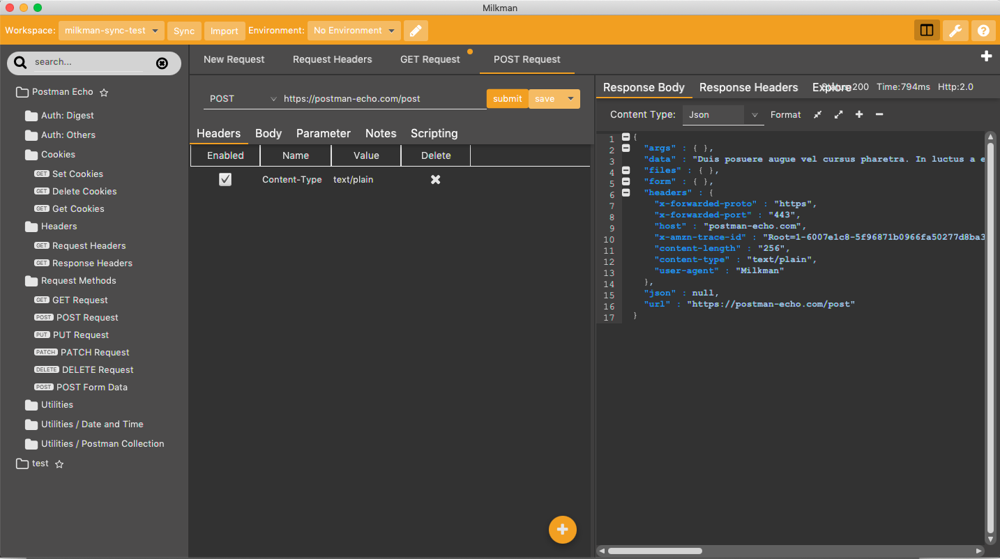

#  Milkman - An Extensible Request/Response Workbench

Milkman is heavily inspired by Postman. But I got sick of all those electron-based applications that need ages and loads of memory to start up.
Therefore i created a JavaFx-based workbench for crafting requests / responses. It is not limited to e.g. http (or more specifically rest) requests. Due to nearly
everything being a plugin, other things are possible, like database-requests or GRPC, GraphQl, etc...

## :exclamation::exclamation: Update on Insomnia

Hello Insomnia Users :wave:. Recently, a way to [import insomnia data](docs/features.md#insomnia-import) was added due to the [latest changes](https://github.com/Kong/insomnia/issues/6577) on insomnia. 
Rest assured that the restriction of having an account in Postman (and now, Insomnia) was one of the main reasons to create Milkman and
such a thing will never ever happen. \
The importer will be available in version 5.7.0 but is already implemented in the [nightly release](https://github.com/warmuuh/milkman/workflows/Nightly/badge.svg?branch=master).

# Download

 * Download latest version in [Release Section](https://github.com/warmuuh/milkman/releases). Or download [Nightly version](https://github.com/warmuuh/milkman/releases/tag/nightly) for latest changes.
 * **Download plugin archive as well**, if you want to use any of those plugins.
 * unzip everything into the same directory and start application via either the supplied start-scripts or `milkman.exe`
   * starting with version 5.8.0, you can install downloaded plugins via [plugin management](/milkman-plugins-management) 

# Install via Chocolatey (Win)
 * To install just Milkman run `Choco install milkman`
 * To install a plugin run `Choco install milkman-<plugin name>` ex. `Choco install milkman-explore`
 * Install Milkman and all plugins available run `Choco install milkman-plugins` 
 * Milkman will be installed under C:\tools\milkman.

# Install via Homebrew (MacOs)
 * To install, run `brew install --cask milkman`. All plugins are included.
 * To update, run `brew upgrade --cask`

# Changes

latest changes can be seen in the [Changelog](changelog.md)

# FAQ

some resolved issues and FAQs are available in the [wiki](https://github.com/warmuuh/milkman/wiki).

# Features

 * **Everything is a plugin:** Request-types (e.g. Http Request), request-aspects (e.g. Headers, Body, etc), editors for request aspects (e.g. table-based editors for headers), importers, whatever it is, you can extend it. The core application only handles Workspaces with Environments, Collections, Requests and their aspects.
 * **Http Request Plugin:** Several plugins are provided already that extend the core application to be a replacement for postman/insomnia. Crafting and Executing Http/Rest requests with json highlighting. Support Proxy-server configuration and SSE.
 * **Grpc Plugin:** support of Grpc Services, Server Reflection and Streaming
 * **Test Runner:** run several requests as separate test-scenario
 * **JavaFX Application:** as in: *fast* (compared to electron at least :D) and skinn-able (you can extend milkman with your own themes using simple CSS).
 * **Commandline Interface:** there is a [command line interface](/milkman-cli) for Milkman which allows to edit/execute requests on your command line.
 * **Slack Command:** you can use `/milkman <privatebin-url>` in slack to share requests in a better way. [More Info](docs/slack-integration.md).
 * [Some more details](docs/features.md) of the core application features, such as hotkeys etc.
 
# Existing Plugins:

*Note: see respective plugin folder for more details*

### [Http Request Plugin](/milkman-rest): (included in main distribution)
The Http request plugin packaged with the release contains all means to do http request as well as import collections, environments or dumps from postman or insomnia.
To migrate from postman, just [export a dump-file from postman](https://learning.getpostman.com/docs/postman/collections/data_formats/#data-dumps) and import it by pasting its content into the `Postman (v2.1) Dump`-Importer. \
To migrate from insomnia, see [docs](docs/features.md#insomnia-import).
The Http Request Plugin also comes with Proxy-support. Some proxies require credentials and support for supplying `BASIC` proxy credentials is built into the plugin. See Options-page to activate that as it is off by default.
Additionally, the plugin supports chunked responses, enabling testing of Server-sent events ([SSE](https://en.wikipedia.org/wiki/Server-sent_events)).

### [Graphql Plugin](/milkman-graphql)
Simple Graphql Plugin to craft  [GraphQL](https://graphql.org/) requests. No Auto-complete or schema valiadtion included.

### [Grpc Plugin](/milkman-grpc)
Grpc plugin with [server-reflection](https://github.com/grpc/grpc/blob/master/doc/server-reflection.md) support and streaming-support. Can also query via proto-defintion.

### [JDBC Plugin](/milkman-jdbc)
This plugin introduces SQL capability to milkman. You can query SQL databases via milkman as well, using JDBC drivers.

### [Cassandra Plugin](/milkman-cassandra):
Allows to execute CQL queries for given cassandra databases.

### [Git Team Synchronization Plugin](/milkman-sync-git)
This plugin allows to synchronize workspaces via Git (using Differential Synchronization). Teams can use this plugin to have a shared workspace that synchronizes between members.

### [Explore Plugin](/milkman-explore):
This plugin extends Rest-responses by adding an `Explore`-Tab where you can use [JMesPath](http://jmespath.org/) queries against a JSON response.

### [Scripting Plugin](/milkman-scripting):
Extends requests by executing a script after request execution. This allows to e.g. set environment variables based on results of json.

### [PrivateBin Sharing Plugin](/milkman-privatebin)
Adds capability to share requests via [PrivateBin](http://PrivateBin.net), including `Burn After Reading` feature

### [Note Plugin](/milkman-note):
This is a sample plugin that allows to add arbitrary description to every request. Serves as a starting point for learning to extend milkman.

### [Test Plugin](/milkman-test)
A testrunner plugin that allows to run multiple requests in sequence and verify the results

### [Auth Plugin](/milkman-auth)
An OAuth Plugin for managing oauth credentials and transparent refreshing of tokens

### [Websocket Plugin](/milkman-ws)
A websocket plugin for interacting with websocket endpoints

### [Socket.IO Plugin](/milkman-sio)
A Socket.IO plugin for interacting with Socket.IO endpoints

### [NoSql Plugin](/milkman-nosql)
A NoSql plugin for interacting with all kinds of NoSql Databases

### [MCP Plugin](/milkman-mcp)
A plugin for interacting with local/remote MCP Servers ([Model Context Protocol](http://modelcontextprotocol.io))

# Showcase

Additional themes available here: https://github.com/lopitz/milkman-themes

# Plugins

No client fits all, so you are **encouraged** to write your own plugins to e.g. add headers that are necessary for your internal service structures or add importers for internal service registries.

A [sample plugin](https://github.com/warmuuh/milkman/tree/master/milkman-note) was provided that extends all requests with a `Note` tab so you can add some description to any kind of requests.

More details about developing plugins can be found in the [plugin development guide](/docs/plugin-development.md).

*Installation:* all plugins are to be copied to the `/plugins` folder (or via [plugin-management](/milkman-plugins-management), since version 5.8.0)

# Changes

latest changes can be seen in the [Changelog](changelog.md)
